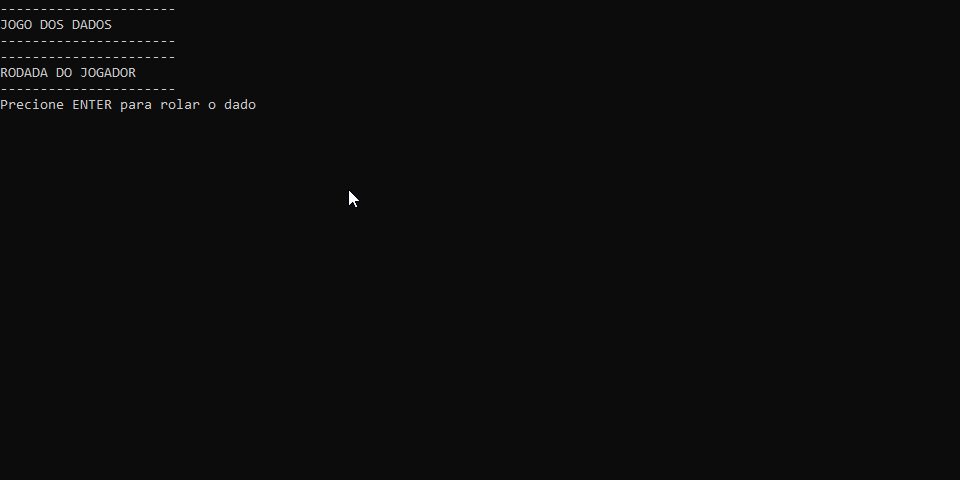

#  JOGO DOS DADOS



## Introdução

Um jogo que simula uma corrida onde o jogador e o computador competem para chegar até a linha de chegada primeiro.

## Regras do jogo

1 - o jogador e a maquina começam na posição 0 da pista e alternam turnos para chegar a ultima posição, 30.

2 - a cada turno um dado é jogado,indo de 1 á 6 e tanto o jogador quanto a maquina avançam adicionando o resultado do dado a sua posição atual

3 - Existem **casas de evento** que dão um bonus ou penalidade tanto ou jogador quanto a maquina,sendo elas:

**Bonus -** ao cair nas casas 5,10,15 ou 25 são avançadas 3 posiçoes adicionais.

**Penalidade -** ao cair nas casas 7,13 ou 20 são regredidas 2 posiçoes.


## Funções

**- Geração de numero aleatório:** a cada turno é gerado um numero aleatorio entre 1 e 6 para ser simbolizar o rolar de dados. 

**- Turnos:** o jogador e maquina alternam de turno para lançar os dados.

**- Casas de evento:** ao cairem em determinadas posiçoes,o jogador ou a maquina podem ganhar um bonus ou sofrer uma penalidade ao depender da casa.

## Como ultilizar

1. Extraia o arquivo JogoDosDados.ConsoleApp do repositório com .zip;

2. Restaure as dependecias do projeto com o ```comando```:
```
dotnet restore
```
3. Agora va até o diretório raiz e execute no terminal com o ```comando```:
```
dotnet run --project JogoDosDados.ConsoleApp
```

## Requisitos

.NET SDK (versão 10)